# OpenShift Tekton CI/CD Lab

Projeto prático de CI/CD utilizando **Red Hat OpenShift**, **Tekton Pipelines**, **Tekton Triggers** e **GitHub Webhook** para automatizar o build e deploy de uma aplicação Flask containerizada.

O fluxo implementado permite que um `git push` no GitHub dispare automaticamente uma Pipeline Tekton dentro do OpenShift, realizando clone do repositório, build da imagem, push para o registry interno e deploy da aplicação.

---

## Visão geral

Fluxo principal da solução:

```text id="9xwz14"
GitHub Push
→ GitHub Webhook
→ ngrok / OpenShift Route
→ Tekton EventListener
→ TriggerBinding
→ TriggerTemplate
→ PipelineRun automático
→ Tekton Pipeline
→ Build da imagem
→ Push no OpenShift Internal Registry
→ Deploy da aplicação no OpenShift
```

---

## Tecnologias utilizadas

* Red Hat OpenShift
* OpenShift Pipelines
* Tekton Pipelines
* Tekton Triggers
* GitHub Webhook
* Python Flask
* Docker/Containerfile
* OpenShift Internal Registry
* Kubernetes Manifests
* ngrok
* Git

---

## Arquitetura

```mermaid id="a3b2l4"
flowchart LR
    DEV[Developer] -->|git push| GH[GitHub Repository]

    GH -->|Webhook Push Event| NGROK[ngrok Tunnel]
    NGROK --> PF[oc port-forward]

    PF --> EL[Tekton EventListener]

    EL --> TB[TriggerBinding]
    EL --> TT[TriggerTemplate]

    TB --> PR[PipelineRun]
    TT --> PR

    PR --> PIPE[Tekton Pipeline]

    PIPE --> T1[Clone Repository]
    T1 --> T2[Build and Push Image]
    T2 --> REG[OpenShift Internal Registry]
    T2 --> T3[Deploy to OpenShift]

    T3 --> DEPLOY[Deployment]
    DEPLOY --> SVC[Service]
    SVC --> APP_ROUTE[Application Route]
    APP_ROUTE --> USER[User Access]
```



---

## Estrutura do repositório

```text id="wzzare"
RHOS_tekton_lab/
│   README.md
│
├── app/
│   ├── app.py
│   ├── Dockerfile
│   └── requirements.txt
│
├── docs/
│   ├── application.md
│   ├── architecture.md
│   ├── github-webhook.md
│   ├── manual-deploy.md
│   ├── oc-commands.md
│   └── pipeline-current-flow.md
│
├── openshift/
│   ├── deployment.yaml
│   ├── route.yaml
│   └── service.yaml
│
└── tekton/
    ├── pipelineruns/
    │   ├── hello-taskrun.yaml
    │   ├── manual-pipelinerun.yaml
    │   └── pipelinerun.yaml
    │
    ├── pipelines/
    │   └── pipeline.yaml
    │
    ├── tasks/
    │   ├── build-and-push-image.yaml
    │   ├── clone-repository.yaml
    │   ├── deploy-to-openshift.yaml
    │   └── hello-task.yaml
    │
    └── triggers/
        ├── docswebhook-test.md
        ├── eventlistener.yaml
        ├── rbac.yaml
        ├── route.yaml
        ├── secret.example.yaml
        ├── triggerbinding.yaml
        └── triggertemplate.yaml
```

---

## Aplicação

A aplicação está localizada no diretório:

```text id="d02v91"
app/
```

Arquivos principais:

| Arquivo            | Descrição                        |
| ------------------ | -------------------------------- |
| `app.py`           | Aplicação Flask                  |
| `requirements.txt` | Dependências Python              |
| `Dockerfile`       | Definição da imagem da aplicação |

---

## Manifests OpenShift

Os manifests da aplicação ficam em:

```text id="gxzrq8"
openshift/
```

| Arquivo           | Descrição                                          |
| ----------------- | -------------------------------------------------- |
| `deployment.yaml` | Define o Deployment da aplicação Flask             |
| `service.yaml`    | Expõe a aplicação internamente no cluster          |
| `route.yaml`      | Expõe a aplicação externamente via OpenShift Route |

---

## Tekton Pipeline

A Pipeline principal está definida em:

```text id="na5ena"
tekton/pipelines/pipeline.yaml
```

Ela executa três etapas principais:

```text id="f1new5"
clone-repository
→ build-and-push-image
→ deploy-to-openshift
```

### Tasks

As Tasks ficam em:

```text id="vgpxmd"
tekton/tasks/
```

| Task                        | Responsabilidade                                                     |
| --------------------------- | -------------------------------------------------------------------- |
| `clone-repository.yaml`     | Clona o repositório GitHub                                           |
| `build-and-push-image.yaml` | Realiza o build da imagem e publica no registry interno do OpenShift |
| `deploy-to-openshift.yaml`  | Atualiza o deploy da aplicação no OpenShift                          |
| `hello-task.yaml`           | Task simples utilizada para validação inicial do Tekton              |

---

## Tekton Triggers

Os manifests de Trigger ficam em:

```text id="c6gvyz"
tekton/triggers/
```

| Arquivo                | Descrição                                          |
| ---------------------- | -------------------------------------------------- |
| `eventlistener.yaml`   | Recebe eventos externos, como webhooks do GitHub   |
| `triggerbinding.yaml`  | Extrai dados do payload recebido                   |
| `triggertemplate.yaml` | Cria o PipelineRun automático                      |
| `rbac.yaml`            | Define permissões necessárias para o EventListener |
| `route.yaml`           | Expõe o EventListener via OpenShift Route          |
| `secret.example.yaml`  | Exemplo de Secret para validação do webhook        |
| `docswebhook-test.md`  | Anotações auxiliares para testes do webhook        |

---

## Pré-requisitos

Para executar este projeto, é necessário ter:

* Cluster OpenShift disponível;
* OpenShift Pipelines instalado;
* Tekton Triggers disponível;
* CLI `oc` configurada;
* CLI `git` configurada;
* Repositório GitHub;
* ngrok instalado, caso o ambiente OpenShift não esteja exposto publicamente;
* Permissão para criar Deployments, Services, Routes, Tasks, Pipelines, PipelineRuns e Triggers no namespace utilizado.

---

## Namespace

O projeto utilizado neste laboratório é:

```text id="ab8mp3"
tekton-lab
```

Criar o projeto:

```bash id="xf3ke4"
oc new-project tekton-lab
```

Selecionar o projeto:

```bash id="obfabq"
oc project tekton-lab
```

---

## Deploy da aplicação

Aplicar os manifests da aplicação:

```bash id="wxnhh5"
oc apply -f openshift/deployment.yaml
oc apply -f openshift/service.yaml
oc apply -f openshift/route.yaml
```

Validar os recursos:

```bash id="y1jkar"
oc get deployment
oc get svc
oc get route
oc get pods
```

---

## Aplicação dos recursos Tekton

Aplicar as Tasks:

```bash id="q5wisv"
oc apply -f tekton/tasks/clone-repository.yaml
oc apply -f tekton/tasks/build-and-push-image.yaml
oc apply -f tekton/tasks/deploy-to-openshift.yaml
```

Aplicar a Pipeline:

```bash id="axg34l"
oc apply -f tekton/pipelines/pipeline.yaml
```

Validar:

```bash id="xkzqsc"
oc get tasks
oc get pipeline
```

---

## PipelineRun manual

Criar um PipelineRun manual:

```bash id="nizv3v"
oc create -f tekton/pipelineruns/manual-pipelinerun.yaml
```

Validar a execução:

```bash id="r5oa90"
oc get pipelinerun
```

Ver detalhes de um PipelineRun:

```bash id="x28e3x"
oc describe pipelinerun <nome-do-pipelinerun>
```

Ver logs usando Tekton CLI:

```bash id="q68zdx"
tkn pipelinerun logs <nome-do-pipelinerun> -f
```

Alternativa usando `oc`:

```bash id="rzff9t"
oc logs -l tekton.dev/pipelineRun=<nome-do-pipelinerun> --all-containers=true
```

---

## Aplicação dos Tekton Triggers

Aplicar os recursos de Trigger:

```bash id="d0uprn"
oc apply -f tekton/triggers/rbac.yaml
oc apply -f tekton/triggers/triggerbinding.yaml
oc apply -f tekton/triggers/triggertemplate.yaml
oc apply -f tekton/triggers/eventlistener.yaml
oc apply -f tekton/triggers/route.yaml
```

Validar:

```bash id="kz1zv2"
oc get eventlistener
oc get triggerbinding
oc get triggertemplate
oc get route
```

---

## Exposição do EventListener

O EventListener pode ser exposto de duas formas:

1. Via OpenShift Route, quando o cluster possui uma URL acessível externamente;
2. Via ngrok, quando o ambiente é local ou não está acessível pela internet.

Em ambientes locais, como CRC, o GitHub normalmente não consegue acessar diretamente domínios internos como:

```text id="n06n7w"
*.apps-crc.testing
```

Nesse cenário, o ngrok pode ser utilizado para criar uma URL pública temporária apontando para o EventListener.

---

## Exposição com ngrok

### 1. Validar o Service do EventListener

```bash id="efn5i7"
oc get svc el-github-eventlistener
```

Exemplo esperado:

```text id="wfi8jd"
NAME                      TYPE        CLUSTER-IP   EXTERNAL-IP   PORT(S)
el-github-eventlistener   ClusterIP   10.x.x.x     <none>        8080/TCP,9000/TCP
```

---

### 2. Fazer port-forward para o EventListener

Em um terminal, executar:

```bash id="lxs53s"
oc port-forward svc/el-github-eventlistener 8080:8080
```

Esse comando encaminha a porta local `8080` para a porta `8080` do Service do EventListener dentro do OpenShift.

Manter esse terminal aberto durante o teste do webhook.

---

### 3. Configurar o ngrok

Adicionar o authtoken da conta ngrok:

```bash id="e3v48y"
ngrok config add-authtoken <SEU_NGROK_AUTHTOKEN>
```

---

### 4. Criar o túnel HTTP

Em outro terminal, executar:

```bash id="j2st1r"
ngrok http 8080
```

O ngrok irá gerar uma URL pública parecida com:

```text id="xgdzbr"
https://xxxx-xxxx-xxxx.ngrok-free.app
```

Essa URL será usada como endpoint público do GitHub Webhook.

---

### 5. Configurar o Webhook no GitHub

No repositório GitHub, acessar:

```text id="h57s0d"
Settings
→ Webhooks
→ Add webhook
```

Configurar:

| Campo        | Valor                                              |
| ------------ | -------------------------------------------------- |
| Payload URL  | URL HTTPS gerada pelo ngrok                        |
| Content type | `application/json`                                 |
| Secret       | Mesmo valor configurado no OpenShift, se aplicável |
| Event        | `Just the push event`                              |
| Active       | Habilitado                                         |

Exemplo de Payload URL:

```text id="m15r23"
https://xxxx-xxxx-xxxx.ngrok-free.app
```

---

### 6. Testar o webhook

Fazer uma alteração no repositório e enviar para o GitHub:

```bash id="j9zpvm"
git add .
git commit -m "test: trigger pipeline from github webhook"
git push
```

Validar se o PipelineRun foi criado automaticamente:

```bash id="sl9s2q"
oc get pipelinerun --sort-by=.metadata.creationTimestamp
```

Exemplo esperado:

```text id="dm3k44"
NAME                         SUCCEEDED   REASON
flask-app-github-run-xxxxx   True        Succeeded
```

---

### 7. Inspecionar chamadas no ngrok

O ngrok disponibiliza uma interface local para inspecionar as requisições recebidas:

```text id="qzgskm"
http://127.0.0.1:4040
```

Essa interface pode ser usada para validar se o GitHub está enviando corretamente o evento de webhook.

---

## GitHub Webhook via OpenShift Route

Caso o cluster OpenShift esteja acessível publicamente, é possível usar diretamente a Route do EventListener.

Obter a Route:

```bash id="tql0co"
oc get route github-eventlistener
```

Exemplo:

```text id="r2dtyv"
github-eventlistener-tekton-lab.apps-crc.testing
```

Payload URL no GitHub:

```text id="ro7nnt"
https://github-eventlistener-tekton-lab.apps-crc.testing
```

Em ambientes locais, essa abordagem pode não funcionar porque o domínio do cluster pode não ser resolvido ou acessado externamente pelo GitHub.

---

## Validação do fluxo automatizado

Após configurar o webhook, cada `git push` deve criar um novo PipelineRun automaticamente.

Comando de validação:

```bash id="jrvk70"
oc get pipelinerun
```

Exemplo:

```text id="mkd13o"
NAME                         SUCCEEDED   REASON
flask-app-github-run-xxxxx   True        Succeeded
```

Também é possível listar por ordem de criação:

```bash id="lii58t"
oc get pipelinerun --sort-by=.metadata.creationTimestamp
```

Validar os pods das Tasks:

```bash id="xw6e3u"
oc get pods
```

Exemplo:

```text id="dg0ftb"
flask-app-github-run-xxxxx-clone-repository-pod       Completed
flask-app-github-run-xxxxx-build-and-push-image-pod   Completed
flask-app-github-run-xxxxx-deploy-to-openshift-pod    Completed
flask-app-xxxxxxxxxx-xxxxx                            Running
```

---

## Troubleshooting

### PipelineRun com erro `InvalidWorkspaceBindings`

Durante a implementação, pode ocorrer o erro:

```text id="srh6ui"
InvalidWorkspaceBindings
```

Esse erro indica que a Pipeline espera um workspace obrigatório, mas o PipelineRun criado não recebeu o binding correto desse workspace.

Em execuções automáticas via webhook, o ponto mais comum de ajuste é o `TriggerTemplate`, pois ele é o responsável por criar o PipelineRun.

Validar o PipelineRun com erro:

```bash id="nxm32r"
oc describe pipelinerun <nome-do-pipelinerun>
```

Validar se a Pipeline exige workspace:

```bash id="l32077"
oc get pipeline <nome-da-pipeline> -o yaml
```

Validar o TriggerTemplate:

```bash id="xmesoc"
oc get triggertemplate <nome-do-triggertemplate> -o yaml
```

Após ajustar o workspace no `TriggerTemplate`, reaplicar o manifesto:

```bash id="mknyyp"
oc apply -f tekton/triggers/triggertemplate.yaml
```

Executar um novo teste com `git push` e validar:

```bash id="oxolqb"
oc get pipelinerun --sort-by=.metadata.creationTimestamp
```

---

## Comandos úteis

Listar os principais recursos:

```bash id="nzlrac"
oc get tasks
oc get pipeline
oc get pipelinerun
oc get eventlistener
oc get triggerbinding
oc get triggertemplate
oc get route
oc get deployment
oc get svc
oc get pods
```

Ver URL da aplicação:

```bash id="d54xyi"
oc get route flask-app
```

Ver URL do EventListener:

```bash id="fmyxse"
oc get route github-eventlistener
```

Ver logs de um PipelineRun:

```bash id="pkpm85"
tkn pipelinerun logs <nome-do-pipelinerun> -f
```

Alternativa:

```bash id="dr2k4s"
oc logs -l tekton.dev/pipelineRun=<nome-do-pipelinerun> --all-containers=true
```

Remover PipelineRuns antigos, se necessário:

```bash id="gr5yef"
oc delete pipelinerun <nome-do-pipelinerun>
```

---

## Documentação complementar

| Documento                       | Descrição                                   |
| ------------------------------- | ------------------------------------------- |
| `docs/application.md`           | Detalhes da aplicação Flask                 |
| `docs/architecture.md`          | Arquitetura da solução                      |
| `docs/github-webhook.md`        | Configuração do webhook no GitHub           |
| `docs/manual-deploy.md`         | Deploy manual da aplicação                  |
| `docs/oc-commands.md`           | Comandos utilizados no OpenShift            |
| `docs/pipeline-current-flow.md` | Fluxo da pipeline                           |
| `docs/troubleshooting.md`       | Problemas encontrados e correções aplicadas |

---

## Resultado

O projeto implementa um fluxo CI/CD funcional com OpenShift Pipelines e Tekton Triggers.

A partir de um `git push`, o GitHub envia um evento de webhook para o EventListener, que cria automaticamente um PipelineRun responsável por clonar o repositório, construir a imagem, publicar no registry interno e atualizar a aplicação no OpenShift.

