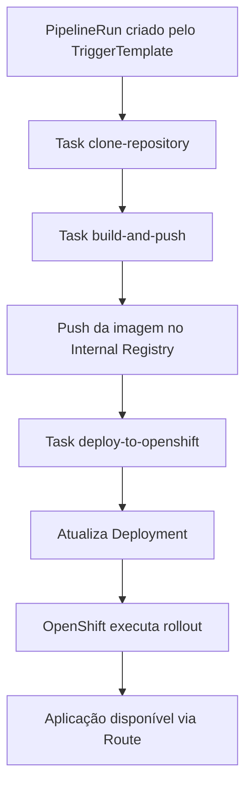

# Arquitetura Final — GitHub Webhook + Tekton + OpenShift

## Objetivo

Esta arquitetura define o fluxo final de CI/CD do laboratório, conectando um repositório GitHub ao OpenShift por meio de Tekton Triggers e Tekton Pipelines.

A ideia principal é que qualquer alteração enviada ao repositório GitHub possa disparar automaticamente uma pipeline responsável por:

1. Clonar o código da aplicação.
2. Construir a imagem container da aplicação Flask.
3. Publicar a imagem no registry interno do OpenShift.
4. Atualizar o Deployment da aplicação.
5. Disponibilizar a nova versão por meio de Service e Route.

---

## Visão Geral do Fluxo

```mermaid
flowchart LR
    DEV[Desenvolvedor] --> GH[GitHub Repository]

    GH -->|Webhook push event| ROUTE[OpenShift Route do EventListener]

    ROUTE --> EL[Tekton EventListener]

    EL --> TB[TriggerBinding]
    EL --> TT[TriggerTemplate]

    TB -->|Extrai dados do evento GitHub| TT
    TT -->|Cria dinamicamente| PR[PipelineRun]

    PR --> PIPE[Tekton Pipeline]

    PIPE --> T1[Clone do repositório]
    T1 --> T2[Build da imagem]
    T2 --> T3[Push para OpenShift Internal Registry]
    T3 --> REG[Internal Registry]

    T3 --> T4[Atualização do Deployment]
    T4 --> DEPLOY[OpenShift Deployment]

    REG --> DEPLOY
    DEPLOY --> POD[Pods da aplicação Flask]

    POD --> SVC[OpenShift Service]
    SVC --> APP_ROUTE[OpenShift Route da aplicação]

    APP_ROUTE --> USER[Usuário acessa a aplicação]
```



---

## Componentes da Arquitetura

### 1. GitHub Repository

O repositório GitHub armazena todos os arquivos do projeto, incluindo:

* Código da aplicação Flask.
* Dockerfile.
* Manifestos OpenShift.
* Tasks Tekton.
* Pipeline Tekton.
* Recursos de Trigger.
* Documentação do laboratório.

Estrutura esperada do projeto:

```text
RHOS_tekton_lab/
├── app/
│   ├── app.py
│   ├── Dockerfile
│   └── requirements.txt
├── docs/
│   ├── architecture.md
│   ├── application.md
│   ├── manual-deploy.md
│   ├── oc-commands.md
│   ├── pipeline-current-flow.md
│   └── evidences/
├── openshift/
│   ├── deployment.yaml
│   ├── service.yaml
│   └── route.yaml
└── tekton/
    ├── tasks/
    ├── pipelines/
    ├── pipelineruns/
    └── triggers/
```

---

### 2. GitHub Webhook

O Webhook será configurado no GitHub para enviar eventos para o OpenShift sempre que ocorrer um `push` no repositório.

Evento esperado:

```text
push
```

Destino do webhook:

```text
https://<route-do-eventlistener>
```

O webhook será exposto publicamente por meio de uma Route do OpenShift apontando para o Service criado pelo Tekton EventListener.

O GitHub será responsável apenas por notificar o OpenShift de que houve uma alteração no repositório. A execução real do processo ficará sob responsabilidade do Tekton.

---

### 3. Tekton EventListener

O EventListener será o ponto de entrada dos eventos enviados pelo GitHub.

Responsabilidades:

* Receber o evento HTTP enviado pelo GitHub.
* Validar o payload recebido.
* Acionar o TriggerBinding.
* Acionar o TriggerTemplate.
* Gerar um PipelineRun dinamicamente.

Nome sugerido:

```text
flask-ci-event-listener
```

---

### 4. Tekton TriggerBinding

O TriggerBinding será responsável por extrair informações do payload enviado pelo GitHub.

Informações importantes que podem ser extraídas:

* URL do repositório.
* Branch.
* Commit SHA.
* Autor do commit.
* Nome do repositório.

Parâmetros sugeridos:

```text
git-repo-url
git-revision
git-branch
commit-sha
```

Exemplo conceitual:

```text
GitHub payload → TriggerBinding → parâmetros da Pipeline
```

---

### 5. Tekton TriggerTemplate

O TriggerTemplate será responsável por criar um PipelineRun com base nos parâmetros recebidos do TriggerBinding.

Responsabilidades:

* Receber os parâmetros extraídos do evento GitHub.
* Criar um novo PipelineRun.
* Passar para a Pipeline a URL do repositório, branch e commit.
* Definir a imagem de destino no registry interno do OpenShift.

Nome sugerido:

```text
flask-ci-trigger-template
```

---

### 6. Tekton Pipeline

A Pipeline será responsável por executar o fluxo completo de CI/CD.

Nome sugerido:

```text
flask-ci-pipeline
```

Fluxo esperado:

```text
clone-repository → build-and-push → deploy-to-openshift
```

Tasks principais:

| Task                  | Responsabilidade                                              |
| --------------------- | ------------------------------------------------------------- |
| `clone-repository`    | Clonar o repositório GitHub                                   |
| `build-and-push`      | Construir a imagem container e enviar para o registry interno |
| `deploy-to-openshift` | Aplicar/atualizar os manifestos da aplicação no OpenShift     |

---

### 7. PipelineRun

O PipelineRun será criado automaticamente pelo TriggerTemplate a cada evento válido recebido do GitHub.

Ele representa uma execução específica da Pipeline.

Cada PipelineRun deverá receber parâmetros como:

```text
git-repo-url
git-revision
image-url
```

Exemplo de imagem gerada:

```text
image-registry.openshift-image-registry.svc:5000/<namespace>/flask-app:<commit-sha>
```

Também poderá ser usada uma tag adicional:

```text
image-registry.openshift-image-registry.svc:5000/<namespace>/flask-app:latest
```

A tag com o `commit-sha` é importante porque permite rastrear exatamente qual versão do código gerou determinada imagem.

---

## ServiceAccounts

A arquitetura final utilizará duas ServiceAccounts principais, separando responsabilidades entre Trigger e Pipeline.

---

### 1. ServiceAccount do EventListener

Nome sugerido:

```text
tekton-triggers-sa
```

Responsabilidade:

* Permitir que o EventListener crie PipelineRuns dinamicamente.

Permissões necessárias:

* Criar PipelineRuns.
* Ler recursos básicos necessários para execução dos Triggers.

Essa ServiceAccount será usada pelo EventListener.

---

### 2. ServiceAccount da Pipeline

Nome sugerido:

```text
pipeline-sa
```

Responsabilidade:

* Executar as Tasks da Pipeline.
* Clonar o repositório.
* Construir a imagem.
* Fazer push no registry interno.
* Atualizar recursos da aplicação no OpenShift.

Permissões necessárias:

| Recurso                        | Permissão                        |
| ------------------------------ | -------------------------------- |
| Pods                           | Criar e executar pods das Tasks  |
| PipelineRuns/TaskRuns          | Executar recursos Tekton         |
| ImageStreams/Internal Registry | Fazer push da imagem             |
| Deployments                    | Criar, atualizar e fazer rollout |
| Services                       | Criar e atualizar                |
| Routes                         | Criar e atualizar                |
| Secrets/ConfigMaps             | Ler quando necessário            |

Para push no registry interno do OpenShift, a ServiceAccount da pipeline deverá possuir permissão equivalente a:

```text
system:image-builder
```

Para atualizar os objetos da aplicação no namespace, a ServiceAccount deverá possuir permissões equivalentes a:

```text
edit
```

Em uma versão mais refinada, a permissão `edit` pode ser substituída por uma Role customizada com permissões mínimas apenas sobre Deployment, Service, Route e ImageStream.

---

## Exposição do Webhook

O GitHub precisa acessar o EventListener por uma URL pública.

Para isso, o EventListener será exposto usando:

```text
OpenShift Route → Service do EventListener → Pod do EventListener
```

Fluxo:

```text
GitHub Webhook
    ↓
OpenShift Route
    ↓
Service do EventListener
    ↓
Tekton EventListener
```

Nome sugerido da Route:

```text
flask-ci-webhook
```

URL esperada:

```text
https://flask-ci-webhook-<namespace>.<apps-domain>
```

Essa URL será cadastrada no GitHub em:

```text
Repository → Settings → Webhooks → Add webhook
```

Configuração sugerida:

| Campo        | Valor                                             |
| ------------ | ------------------------------------------------- |
| Payload URL  | URL da Route do EventListener                     |
| Content type | `application/json`                                |
| Event        | `push`                                            |
| Secret       | Secret compartilhado entre GitHub e EventListener |

---

## Estratégia de Build e Push da Imagem

O build será executado dentro da Pipeline usando uma Task baseada em Buildah.

Entrada:

```text
app/Dockerfile
app/app.py
app/requirements.txt
```

Imagem de destino:

```text
image-registry.openshift-image-registry.svc:5000/<namespace>/flask-app:<commit-sha>
```

Também poderá ser criada a tag:

```text
image-registry.openshift-image-registry.svc:5000/<namespace>/flask-app:latest
```

Fluxo:

```text
Código Flask
    ↓
Dockerfile
    ↓
Buildah
    ↓
Imagem container
    ↓
OpenShift Internal Registry
```

O uso do registry interno evita dependência inicial de Docker Hub, Quay.io ou outro registry externo.

---

## Estratégia de Deploy

O deploy será atualizado pela própria Pipeline após o push da imagem.

Fluxo esperado:

```text
oc apply -f openshift/
oc set image deployment/flask-app flask-app=<imagem-gerada>
oc rollout status deployment/flask-app
```

A aplicação será composta por:

| Componente | Função                                      |
| ---------- | ------------------------------------------- |
| Deployment | Executar os pods da aplicação Flask         |
| Service    | Expor a aplicação internamente no namespace |
| Route      | Expor a aplicação externamente              |

A atualização da imagem no Deployment fará o OpenShift iniciar um novo rollout automaticamente.

---

## Fluxo Final de Execução

1. Desenvolvedor faz alteração no código.
2. Desenvolvedor executa `git push`.
3. GitHub dispara o webhook.
4. OpenShift Route recebe a requisição.
5. Route encaminha para o Tekton EventListener.
6. EventListener processa o evento.
7. TriggerBinding extrai os dados do payload.
8. TriggerTemplate cria um novo PipelineRun.
9. PipelineRun executa a Pipeline.
10. Pipeline clona o repositório.
11. Pipeline constrói a imagem da aplicação Flask.
12. Pipeline envia a imagem para o OpenShift Internal Registry.
13. Pipeline aplica ou atualiza os manifestos do OpenShift.
14. Pipeline atualiza a imagem do Deployment.
15. OpenShift executa o rollout.
16. Usuário acessa a nova versão da aplicação pela Route.

---

## Decisões de Arquitetura

| Decisão                      | Definição                              |
| ---------------------------- | -------------------------------------- |
| Origem do código             | GitHub Repository                      |
| Disparo automático           | GitHub Webhook                         |
| Entrada no OpenShift         | Tekton EventListener exposto via Route |
| Criação dinâmica da execução | TriggerTemplate criando PipelineRun    |
| Extração de dados do webhook | TriggerBinding                         |
| Execução CI/CD               | Tekton Pipeline                        |
| Build da imagem              | Buildah                                |
| Registry                     | OpenShift Internal Registry            |
| Deploy                       | Deployment, Service e Route            |
| Atualização da aplicação     | `oc set image` + rollout               |
| ServiceAccount do Trigger    | `tekton-triggers-sa`                   |
| ServiceAccount da Pipeline   | `pipeline-sa`                          |

---

## Modelo Conceitual da Pipeline



---

## Resultado Esperado

Ao final da implementação desta arquitetura, o projeto terá um fluxo automatizado de CI/CD:

```text
git push → webhook → EventListener → PipelineRun → build → push → deploy
```

Esse modelo demonstra um fluxo real de entrega contínua em OpenShift, usando recursos nativos da plataforma e separando claramente as responsabilidades entre GitHub, Tekton e Kubernetes/OpenShift.

A arquitetura também deixa o projeto mais apresentável para GitHub e LinkedIn, pois evidencia entendimento de:

* CI/CD em Kubernetes/OpenShift.
* Tekton Pipelines.
* Tekton Triggers.
* Webhooks.
* Registry interno do OpenShift.
* Deploy automatizado.
* Separação de responsabilidades.
* Uso de ServiceAccounts e permissões.

