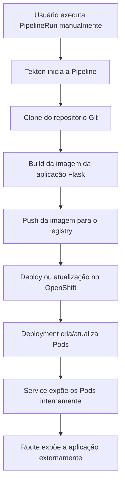

# Fluxo atual da Pipeline Tekton

Este documento descreve o fluxo atual da pipeline Tekton utilizada no laboratório.

A pipeline representa a primeira etapa de automação do processo de entrega da aplicação Flask no OpenShift.

## Objetivo

O objetivo da pipeline atual é automatizar o processo de build e deploy da aplicação Flask.

Ela permite sair de um fluxo manual, baseado apenas em `oc apply`, para um fluxo controlado por PipelineRun no Tekton.

## Estrutura dos arquivos Tekton

Os arquivos da pipeline estão localizados no diretório `tekton/`:

```bash
tekton/
├── tasks/
│   └── hello-task.yaml
├── pipelines/
│   └── pipeline.yaml
└── pipelineruns/
    ├── hello-taskrun.yaml
    └── pipelinerun.yaml
```

## Componentes principais

### Task

Uma `Task` representa uma etapa reutilizável dentro do Tekton.

Ela pode executar ações como:

- Clonar um repositório.
- Construir uma imagem.
- Publicar uma imagem em um registry.
- Aplicar manifests no OpenShift.
- Executar comandos auxiliares.

### Pipeline

Uma `Pipeline` organiza uma ou mais Tasks em uma sequência lógica.

Ela define a ordem de execução e como os dados são compartilhados entre as etapas.

### PipelineRun

Uma `PipelineRun` representa uma execução da Pipeline.

Cada execução cria os recursos necessários para rodar as Tasks e acompanhar o resultado do processo.

## Fluxo atual

Atualmente, o fluxo da pipeline é iniciado manualmente através da criação de uma `PipelineRun`.

```text
Usuário
  ↓
oc create -f tekton/pipelineruns/pipelinerun.yaml
  ↓
PipelineRun
  ↓
Clone do repositório
  ↓
Build da imagem container
  ↓
Push da imagem para o registry
  ↓
Deploy da aplicação no OpenShift
  ↓
Aplicação disponível via Route
```

## Diagrama do fluxo atual



## Execução da PipelineRun

Para executar a pipeline manualmente:

```bash
oc create -f tekton/pipelineruns/pipelinerun.yaml
```

O comando `oc create` é utilizado porque cada `PipelineRun` representa uma execução específica da pipeline.

Caso uma PipelineRun com o mesmo nome já exista, será necessário removê-la ou alterar o nome da nova execução.

Exemplo para remover uma execução anterior:

```bash
oc delete pipelinerun <nome-da-pipelinerun>
```

## Validando a PipelineRun

```bash
oc get pipelineruns
```

Exemplo de saída esperada:

```bash
NAME              SUCCEEDED   REASON      STARTTIME   COMPLETIONTIME
flask-build-run   True        Succeeded   5m          2m
```

## Validando TaskRuns

```bash
oc get taskruns
```

Exemplo de saída esperada:

```bash
NAME                                      SUCCEEDED   REASON      STARTTIME   COMPLETIONTIME
flask-build-run-clone-repository          True        Succeeded   5m          4m
flask-build-run-build-and-push            True        Succeeded   4m          2m
```

## Validando Pods criados pela pipeline

```bash
oc get pods
```

Exemplo de saída esperada:

```bash
NAME                                                   READY   STATUS      RESTARTS   AGE
flask-build-run-xxxxx-clone-repository-pod             0/1     Completed   0          4m
flask-build-run-xxxxx-build-and-push-pod               0/1     Completed   0          3m
flask-app-xxxxxxxxxx-xxxxx                             1/1     Running     0          2m
```

## Visualizando logs da pipeline

Utilizando Tekton CLI:

```bash
tkn pipelinerun logs <nome-da-pipelinerun> -f
```

Exemplo:

```bash
tkn pipelinerun logs flask-build-run -f
```

Alternativa utilizando apenas `oc`:

```bash
oc logs <nome-do-pod-da-task>
```

## Estado atual da automação

No estado atual, a pipeline já automatiza etapas importantes do fluxo de entrega, porém ainda depende de uma execução manual da `PipelineRun`.

O processo atual pode ser resumido da seguinte forma:

```text
Execução manual → PipelineRun → Build → Push → Deploy
```

## Limitação atual

A principal limitação do fluxo atual é que ele ainda não é iniciado automaticamente a partir de alterações no repositório Git.

Ou seja, mesmo que um novo commit seja enviado para o GitHub, a pipeline não será executada automaticamente.

## Próxima evolução

A próxima fase do projeto será implementar o fluxo automatizado com Tekton Triggers e GitHub Webhook.

Fluxo desejado:

```text
GitHub Push
  ↓
GitHub Webhook
  ↓
Tekton EventListener
  ↓
TriggerBinding
  ↓
TriggerTemplate
  ↓
PipelineRun
  ↓
Build
  ↓
Deploy
```

## Resultado esperado

Ao final desta etapa, o fluxo atual da pipeline fica documentado de forma clara, permitindo entender:

- Como a pipeline é executada atualmente.
- Quais etapas fazem parte do processo.
- Como validar a execução.
- Como consultar logs.
- Qual é a limitação atual.
- Qual será a próxima evolução do projeto.
